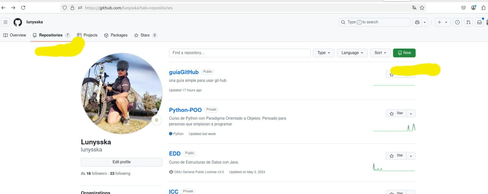
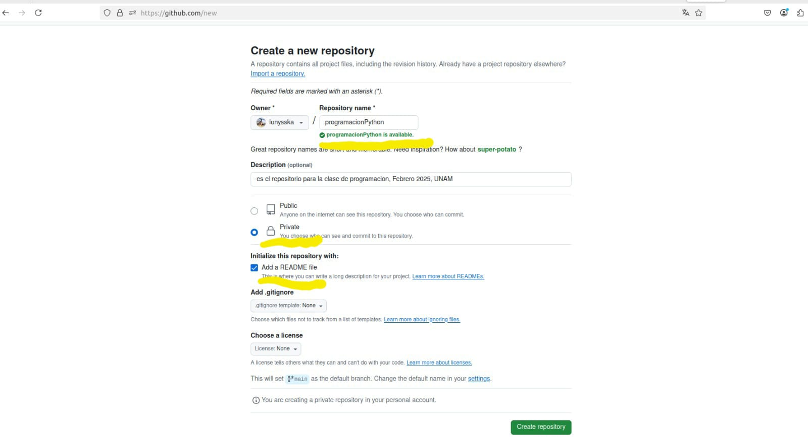
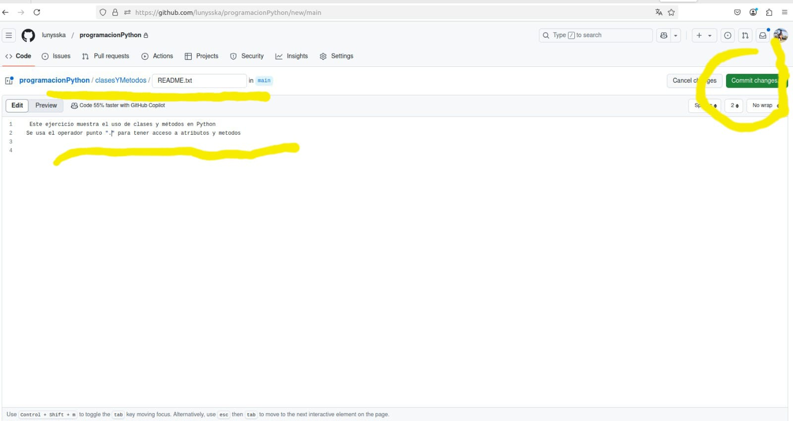
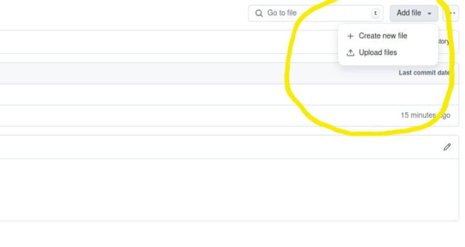
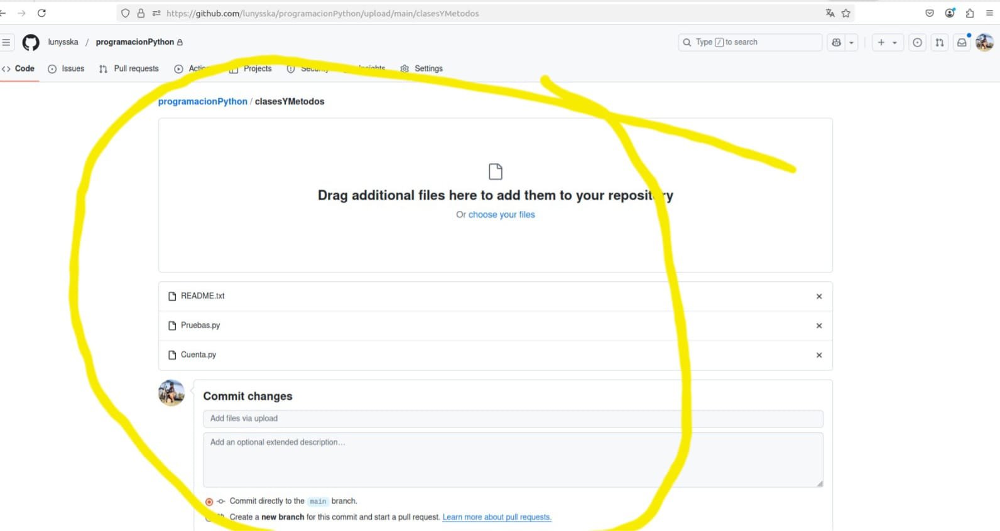

# Uso sencillo de git-hub 

## Objetivo 
Esta guía es para iniciar a usuarios básicos en la programación y en el uso de herramientas para almacenar códigos.
Se usará de manera simple la interfaz gráfica que provee el sitio de git-hub.

### El repositorio

#### 1. Crear el repositorio
- Ir a la opción de "Repositorios"
- Elegir la opción de nuevo "new"

 

#### 2. Elegir las opciones para el repositorio
- Elegir el nombre del repositorio **programacionPython**
- Elegir la privacidad a privado **private**
- Agregar un READEME, elegir que si **palomita activada**
- Oprimir el botón de crear repositorio **Create repository**

#### 3. El repositorio ya quedó listo
- Puedes verificar que tu repositorio ya quedó listo
- Incluye un archivo README.md, que es la extensión para *markdown*
- Puedes editar este archivo, para agregar tu nombre, o una explicación de qué va este proyecto, para eso usas la opción del ícono de *lápiz*

#### 4. Compartir un repositorio
Hay ocasiones que se requiere compartir un repositorio con otros colaboradores
Para este caso compartiremos el respositorio con la titular del curso
- Este paso se puede ver en correos pasados

#### 5. Crear directorios dentro del repositorio
Hacer carpetas dentro de un repositorio es indispensable para mantener comunicación con otros colaboradores
- Haremos el directorio **clasesYMetodos**
- Se usa la opción **Add file->Create new file**
- En el campo de texto se pone el nombre del directorio, usando diagonales, se van creando los directorios de manera automática
- Al final se pone el nombre del Archivo, en este caso, como no deja crear directorios vacios, aprovecharemos para crear un archivo explicativo **README.txt** (pon mucha atención en el nombre, que va de mayúsculas y tiene una extensión .txt)
- En el area de edición se da un texto explicativo de lo que trata ese ejercicio. Ahí coloquen todo el texto que les ayude posteriormente a recordar lo que hicieron, junto con sus datos y fecha, etc.
- Y se oprime la opción "Commit changes" para que se muestre el cambio.

#### 6. Subir archivos
Ya solo falta subir archivos, de cualquer extensión **.py**
- Identificar la opción **Add file->Upload files**
- Se pueden *seleccionar* más de un archivo

- sólo hay que asegurarse que los archivos que se enlistan son los que necesitas subir
- si el nombre de un archivo ya existe, se reemplaza sin preguntarte

### Referencias

- [https://docs.github.com/es/repositories/creating-and-managing-repositories/creating-a-new-repository](https://docs.github.com/es/repositories/creating-and-managing-repositories/creating-a-new-repository)
- [https://rogerdudler.github.io/git-guide/index.es.html](https://rogerdudler.github.io/git-guide/index.es.html)
- [https://training.github.com/downloads/es_ES/github-git-cheat-sheet.pdf](https://training.github.com/downloads/es_ES/github-git-cheat-sheet.pdf)
  
